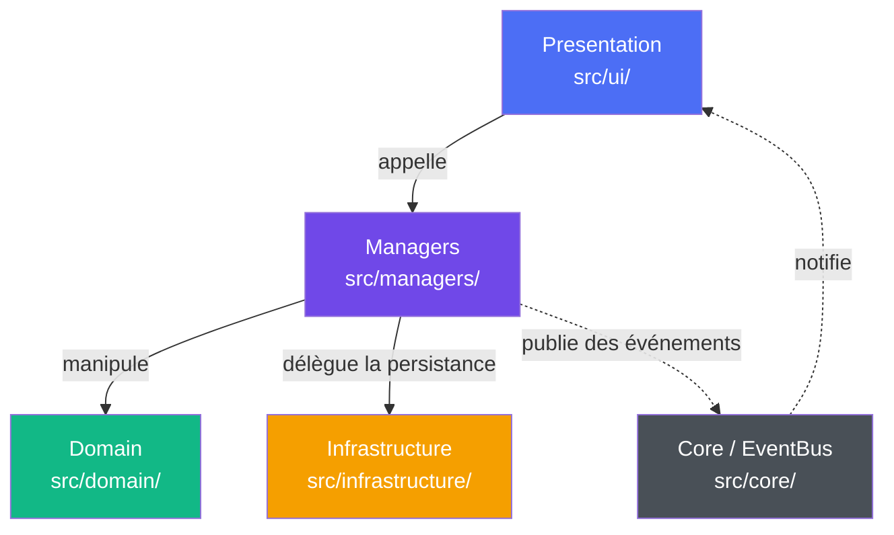

# AI Studio Toolkit


**Application desktop pour orchestrer la production de personnages numériques générés par IA.**

Statut : en développement actif — architecture conforme au Blueprint depuis la Mission 001 (`v0.2-mission001`), enrichie du domaine Character en Mission 002 (`v0.2-mission002`), du domaine Dataset en Mission 003 (`v0.2-mission003`), du domaine LoRA en Mission 004 (`v0.2-mission004`), du domaine Prompt en Mission 005 (`v0.2-mission005`) puis du domaine Model en Mission 006 (`v0.2-mission006`). Fonctionnalités encore limitées à la gestion de workspace, de personnages, de datasets, de LoRA, de prompts, de modèles et à l'import d'images.

## Sommaire

- [Présentation](#présentation)
- [Pourquoi AI Studio Toolkit ?](#pourquoi-ai-studio-toolkit-)
- [Objectifs](#objectifs)
- [Fonctionnalités actuelles](#fonctionnalités-actuelles)
- [Captures d'écran](#captures-décran)
- [Architecture actuelle](#architecture-actuelle)
- [Architecture](#architecture)
- [Principes de conception](#principes-de-conception)
- [Installation](#installation)
- [Lancement](#lancement)
- [Tests](#tests)
- [Structure du dépôt](#structure-du-dépôt)
- [Roadmap des prochaines missions](#roadmap-des-prochaines-missions)
- [Releases](#releases)
- [Licence](#licence)

---

## Présentation

AI Studio Toolkit est une application desktop (PySide6) qui vise à devenir un espace de travail unifié pour la production de contenu IA : création de personnages numériques, entraînement de modèles, gestion de datasets, génération d'images et de vidéos, gestion de prompts et de workflows.

Le logiciel ne remplace pas les moteurs IA existants — il les orchestre. ComfyUI reste responsable de la génération d'images par nodes, OneTrainer et Kohya_ss de l'entraînement de modèles, les moteurs cloud (GPT Image 2, Kling, fal.ai, etc.) de la génération distante. AI Studio Toolkit coordonne l'ensemble depuis une interface unique, pour éviter à l'utilisateur de jongler entre des dizaines d'outils séparés pendant une production.

La vision complète du produit est documentée dans [`docs/blueprint/00_VISION.md`](docs/blueprint/00_VISION.md).

## Pourquoi AI Studio Toolkit ?

Produire un personnage numérique avec l'IA aujourd'hui implique de jongler entre de nombreux outils indépendants : un node-editor pour générer des images, un outil séparé pour entraîner un LoRA, un service cloud pour la vidéo, un gestionnaire de fichiers pour organiser les datasets. Chaque outil a sa propre interface, son propre format de fichier, sa propre courbe d'apprentissage — et rien ne relie une génération à son contexte de production une fois l'outil fermé.

AI Studio Toolkit part du principe qu'il ne faut **pas réinventer** ces outils, mais les **orchestrer** : ComfyUI reste responsable de la génération d'images par nodes, OneTrainer et Kohya_ss de l'entraînement de LoRA, les moteurs cloud (GPT Image 2, Kling, fal.ai, Seedance, Seedream, Higgsfield...) de la génération distante. Le rôle du logiciel est de fournir l'espace de travail qui coordonne ces moteurs, organise leurs résultats et fait persister le contexte d'une production — personnages, datasets, historique — d'un bout à l'autre du cycle, plutôt que de le laisser éclaté entre dix applications.

## Objectifs

- Offrir un espace de travail unique couvrant tout le cycle de production : création → datasets → entraînement → génération → publication → archivage.
- Garder chaque sous-système indépendant et remplaçable (modularité), pour ajouter ou retirer une fonctionnalité sans casser le reste.
- Traiter chaque moteur IA (local ou cloud) comme un plugin interchangeable, jamais comme une dépendance en dur du cœur applicatif.
- Ne jamais modifier les données de l'utilisateur de façon destructrice ou irréversible.

Le détail des exigences fonctionnelles se trouve dans [`docs/blueprint/01_PRODUCT_REQUIREMENTS.md`](docs/blueprint/01_PRODUCT_REQUIREMENTS.md).

## Fonctionnalités actuelles

L'application en est aux fondations architecturales ; les fonctionnalités IA elles-mêmes (génération, entraînement, moteurs) ne sont pas encore implémentées. Ce qui fonctionne aujourd'hui :

- **Gestion de workspace** — création, ouverture et sauvegarde d'un projet (`project.json`), avec gestion d'erreurs (fichier corrompu, échec d'écriture) remontée à l'utilisateur.
- **Gestion de personnages (Character)** — création, sélection et suppression de personnages au sein d'un workspace, persistés dans `project.json`. Historique reste à venir — identité, datasets, LoRA et prompts sont désormais pleinement fonctionnels.
- **Gestion de datasets** — création, sélection et suppression de datasets au sein du personnage actif, avec import d'images propre à chaque dataset (déduplication, ordre préservé), persistés dans `project.json`.
- **Gestion de LoRA** — création, sélection et suppression de LoRA au sein du personnage actif, avec import de fichiers techniques (`.safetensors`, etc.) propre à chaque LoRA (déduplication, ordre préservé), persistés dans `project.json`. Les champs descriptifs du Domain (`engine`, `architecture`, `trigger_word`, `version`, `thumbnail`) existent mais ne sont pas encore exposés dans l'interface.
- **Gestion de prompts** — création, sélection et édition de prompts au sein du personnage actif, persistés dans `project.json`. Le Domain reste volontairement minimal (`prompt_id`, `name`, `text`) : les catégories de prompts (Master, Negative, Generation, Training, Template, Dynamic...) sont différées, pas abandonnées — voir CHANGELOG.
- **Gestion de modèles (Model)** — création, sélection et suppression de modèles au sein du workspace (pas du personnage actif — voir CHANGELOG), avec association d'un fichier via sélecteur natif, persistés dans `project.json`. Domain volontairement minimal (`model_id`, `name`, `file_path`) ; métadonnées descriptives (`provider`, `hash`, `architecture`...) différées.
- **Import d'images (Workspace)** — sélection de fichiers, déduplication, persistance réelle dans le workspace (survit à une fermeture/réouverture). Indépendant de l'import d'images par dataset ci-dessus — les deux chemins coexistent, aucune migration n'a eu lieu.
- **Dashboard réactif** — les compteurs (images, datasets, modèles, LoRA) se mettent à jour automatiquement via un système d'événements, sans rafraîchissement manuel. Le compteur Models reste basé sur `Workspace.models`, désormais réellement peuplé mais pas encore affiché correctement (pas d'agrégation par personnage possible pour cette ressource partagée) — correctif différé à une mission ultérieure.
- **Navigation par sidebar** — 10 sections : Dashboard, Characters, Images, Datasets, Models, LoRA, Prompts, Training, Inference, Settings. Les pages Models, Training, Inference et Settings sont pour l'instant des interfaces vitrines, sans logique métier branchée.

## Captures d'écran

Aucune capture pour l'instant — l'interface évolue encore rapidement pendant la phase de fondations architecturales. Emplacements réservés pour les prochaines captures, dans `docs/images/` :

- `docs/images/dashboard.png` — Vue Dashboard
- `docs/images/images-page.png` — Page Images
- `docs/images/main-window.png` — Fenêtre principale

## Architecture actuelle

Le projet en est à l'étape **Blueprint 02** ([`docs/blueprint/02_ARCHITECTURE.md`](docs/blueprint/02_ARCHITECTURE.md)) : la Mission 001 a posé les fondations architecturales — couches Presentation / Managers / Domain / Infrastructure / Core, `EventBus`, source unique de vérité — sans introduire de nouvelle fonctionnalité IA. La Mission 002 a introduit `Character`, la première entité du Domain Model au-delà de `Workspace`, avec un périmètre volontairement minimal. La Mission 003 a introduit `Dataset`, deuxième entité de la hiérarchie `Character → Datasets` — cette fois avec une différence assumée : `Dataset.images` est fonctionnel dès son introduction, plutôt que de rester une coquille vide en attendant une mission de migration ultérieure.

La Mission 004 a introduit `LoRA`, troisième entité de cette hiérarchie (`Character → LoRAs`), avec `LoRA.files` fonctionnel dès son introduction comme `Dataset.images`, et un Domain volontairement plus riche que celui de `Dataset` dès sa conception (fichiers techniques, aperçu, métadonnées descriptives).

La Mission 005 a introduit `Prompt`, quatrième entité de cette hiérarchie (`Character → Prompt Library`), avec un retour délibéré au minimalisme de `Dataset` après l'exception `LoRA` — les catégories de prompts prévues par le Blueprint sont explicitement différées jusqu'à l'existence d'un consommateur réel.

La Mission 006 a introduit `Model`, cinquième entité du Domain Model et la première rattachée exclusivement au `Workspace` plutôt qu'au `Character` — démontré par huit citations Blueprint indépendantes. Premier Manager du projet sans dépendance à `CharacterManager`.

Les fonctionnalités décrites dans la Vision et les Exigences produit (génération d'images et de vidéos, entraînement de LoRA, moteurs, plugins, personnages numériques...) seront introduites progressivement, mission après mission, chacune s'appuyant sur ces fondations plutôt que sur des raccourcis. Voir la [Roadmap](#roadmap-des-prochaines-missions) ci-dessous.

## Architecture

L'application suit une architecture en couches définie dans [`docs/blueprint/02_ARCHITECTURE.md`](docs/blueprint/02_ARCHITECTURE.md), où les dépendances ne circulent que vers le bas :



- **Presentation** (`src/ui/`) — fenêtre principale, pages, widgets. Affiche l'information et collecte les entrées utilisateur ; ne lit jamais un fichier ni n'appelle une API directement.
- **Managers** (`src/managers/`) — ex. `WorkspaceManager`, `CharacterManager`, `DatasetManager`, `LoRAManager`, `PromptManager`, `ModelManager`, sources uniques de vérité pour l'état du workspace, des personnages, des datasets, des LoRA, des prompts et des modèles. Coordonnent les opérations, ne manipulent jamais de widgets.
- **Domain** (`src/domain/`) — ex. `Workspace`, `Character`, `Dataset`, `LoRA`, `Prompt`, `Model`, objets métier sérialisables, indépendants de Qt et du stockage.
- **Infrastructure** (`src/infrastructure/`) — ex. `WorkspaceStorage`, persistance JSON, gestion d'erreurs typées. Ne connaît pas le Domain : elle échange des dictionnaires, pas des objets métier.
- **Core** (`src/core/`) — ex. `EventBus`, mécanisme pub/sub découplé (sans Qt) permettant à la Presentation de réagir aux changements d'état sans lien direct avec les Managers.

Cette architecture est le résultat de la **Mission 001** (voir [`CHANGELOG.md`](CHANGELOG.md)) : le prototype initial gérait son état de façon ad hoc directement dans l'UI ; il a été refactoré pour se conformer strictement à ce schéma de dépendances, sans changement de fonctionnalité. La **Mission 002** a étendu ce schéma à `Character` en respectant les mêmes règles dès son introduction, plutôt que de les rattraper après coup. La **Mission 003** a fait de même pour `Dataset`, et a corrigé en ouverture de mission une dette identifiée lors d'un audit dédié : `MainWindow` importait une exception directement depuis l'Infrastructure, contournant les Managers. La **Mission 004** a fait de même pour `LoRA`, corrigeant également en ouverture de mission une dette identifiée lors de son propre audit : la carte Dashboard "Datasets" lisait un champ vestigial au lieu d'agréger les données réelles. La **Mission 005** a fait de même pour `Prompt`, corrigeant elle aussi en ouverture de mission le même type de dette sur la carte Dashboard "LoRA". La **Mission 006** a fait de même pour `Model`, sans dette à corriger en ouverture cette fois — la carte Dashboard "Models" reste différée, sa correction nécessitant une réflexion propre (pas d'agrégation par personnage possible pour une ressource Workspace-owned).

## Principes de conception

Ces règles, définies dans [`docs/blueprint/02_ARCHITECTURE.md`](docs/blueprint/02_ARCHITECTURE.md), s'appliquent à tout nouveau code, sans exception :

- **Single Source of Truth** — un seul objet représente l'état réel à un instant donné (ex. `WorkspaceManager.current_workspace`) ; jamais de duplication d'état entre l'UI et les Managers.
- **Dependency Rule** — les dépendances ne remontent jamais : `Presentation → Managers → Domain → Infrastructure`, jamais l'inverse.
- **Event Driven UI** — les pages ne se rafraîchissent jamais par appel direct entre elles ; elles s'abonnent aux événements publiés par l'`EventBus`.
- **Domain indépendant de Qt** — les objets métier (`Workspace`, ...) n'importent jamais PySide6 et restent testables sans interface graphique.
- **Infrastructure ignorant le Domain** — la couche de stockage échange des dictionnaires, jamais des objets métier ; la conversion est la responsabilité des Managers.
- **Managers sans widgets Qt** — les Managers coordonnent l'état applicatif mais ne créent, ne lisent ni ne modifient jamais un widget directement.

## Installation

Prérequis : Python 3.10+ recommandé.

```bash
git clone <url-du-dépôt>
cd AI-Studio-Toolkit
python -m venv .venv
.venv\Scripts\activate          # Windows
pip install -r requirements.txt
```

## Lancement

Depuis la racine du dépôt :

```bash
python -m src.core.main
```

## Tests

```bash
# Tests d'intégration
python -m unittest tests.integration.test_workspace_roundtrip -v
python -m unittest tests.integration.test_character_roundtrip -v
python -m unittest tests.integration.test_dataset_roundtrip -v
python -m unittest tests.integration.test_lora_roundtrip -v
python -m unittest tests.integration.test_prompt_roundtrip -v
python -m unittest tests.integration.test_model_roundtrip -v

# Tous les tests du projet
python -m unittest discover -s tests -v
```

## Structure du dépôt

```
AI-Studio-Toolkit/
├── assets/                     # Icônes, thèmes, templates — vide pour l'instant
├── datasets/                   # Datasets importés — vide pour l'instant
├── docs/
│   ├── blueprint/              # Documents de référence architecturale (source de vérité)
│   │   ├── 00_VISION.md
│   │   ├── 01_PRODUCT_REQUIREMENTS.md
│   │   ├── 02_ARCHITECTURE.md
│   │   ├── 03_PROJECT_STRUCTURE.md
│   │   └── 04_DOMAIN_MODEL.md
│   └── images/                 # Captures d'écran (à venir)
├── examples/                   # Exemples d'utilisation — vide pour l'instant
├── models/                     # Checkpoints, LoRA, VAE partagés — vide pour l'instant
├── scripts/                    # Scripts utilitaires, packaging — vide pour l'instant
├── src/
│   ├── core/                   # EventBus, point d'entrée, bootstrap
│   │   ├── event_bus.py
│   │   └── main.py
│   ├── domain/                 # Objets métier (Workspace, Character, Dataset, LoRA, Prompt, Model, ...)
│   │   ├── workspace.py
│   │   ├── character.py
│   │   ├── dataset.py
│   │   ├── lora.py
│   │   ├── prompt.py
│   │   └── model.py
│   ├── infrastructure/         # Persistance
│   │   └── storage/
│   │       └── workspace_storage.py
│   ├── managers/                # Coordination applicative (WorkspaceManager, CharacterManager, DatasetManager, LoRAManager, PromptManager, ModelManager, ...)
│   │   ├── workspace_manager.py
│   │   ├── character_manager.py
│   │   ├── dataset_manager.py
│   │   ├── lora_manager.py
│   │   ├── prompt_manager.py
│   │   └── model_manager.py
│   ├── ui/                     # Fenêtre principale, pages, widgets
│   │   ├── main_window.py
│   │   └── pages/
│   │       ├── characters_page.py
│   │       ├── datasets_page.py
│   │       ├── lora_page.py
│   │       ├── prompts_page.py
│   │       └── models_page.py
│   ├── resources/               # Ressources embarquées (icônes, thèmes...) — vide pour l'instant
│   ├── services/                 # Opérations métier réutilisables — vide pour l'instant
│   └── utils/                   # Utilitaires transverses — vide pour l'instant
├── tests/
│   └── integration/
│       ├── test_workspace_roundtrip.py
│       ├── test_character_roundtrip.py
│       ├── test_dataset_roundtrip.py
│       ├── test_lora_roundtrip.py
│       ├── test_prompt_roundtrip.py
│       └── test_model_roundtrip.py
├── workflows/                   # Workflows ComfyUI/Fooocus, presets — vide pour l'instant
├── CHANGELOG.md
├── README.md
├── pyproject.toml
└── requirements.txt
```

## Roadmap des prochaines missions

L'historique détaillé et le raisonnement derrière chaque décision se trouvent dans [`CHANGELOG.md`](CHANGELOG.md).

| Mission | Statut | Contenu |
|---|---|---|
| Mission 001 | ✅ Terminée (`v0.2-mission001`) | Refactoring Blueprint 02 : couches Presentation / Managers / Domain / Infrastructure / Core, `EventBus`, tests d'intégration |
| Mission 002 | ✅ Terminée (`v0.2-mission002`) | Introduction du domaine `Character`, entité centrale du Blueprint : CRUD, sélection, persistance, page dédiée |
| Mission 003 | ✅ Terminée (`v0.2-mission003`) | Introduction du domaine `Dataset` : CRUD, sélection, import d'images fonctionnel dès cette mission (déduplication, ordre préservé) |
| Mission 004 | ✅ Terminée (`v0.2-mission004`) | Introduction du domaine `LoRA` : CRUD, sélection, import de fichiers fonctionnel dès cette mission (déduplication, ordre préservé) ; Domain volontairement étendu (8 champs) au-delà du minimalisme appliqué à `Character`/`Dataset` |
| Mission 005 | ✅ Terminée (`v0.2-mission005`) | Introduction du domaine `Prompt` : CRUD, sélection, édition de texte (`update_text()`, idempotent) ; Domain volontairement minimal (3 champs), catégories différées ; correctif Dashboard "LoRA" traité en ouverture |
| Mission 006 | ✅ Terminée (`v0.2-mission006`) | Introduction du domaine `Model` : CRUD, sélection, association de fichier (`update_file_path()`, idempotent) ; première ressource Workspace-owned, premier Manager sans dépendance à `CharacterManager` ; correctif Dashboard "Models" différé (pas d'agrégation par personnage possible) |
| Missions suivantes | 📋 Planifiées | `Job`, `Engine`, `Plugin` (une entité par mission, sans anticipation non justifiée) ; migration de `ImagesPage`/`Workspace.images` vers `Character.images` (toujours différée) ; couche Services dès qu'une logique métier réelle la justifie ; `src/engines/` et `src/plugins/` lors de la première intégration réelle avec un moteur externe |

Amélioration UX ponctuelle identifiée en cours de route, hors périmètre des missions d'architecture : création du dossier cible directement depuis le dialogue "Nouveau projet", sans devoir le créer manuellement au préalable dans l'explorateur Windows.

## Releases

- **[`v0.2-mission006`](CHANGELOG.md)** — introduction du domaine `Model`, première ressource Workspace-owned (CRUD, sélection, association de fichier). Détail complet dans [`CHANGELOG.md`](CHANGELOG.md).
- **[`v0.2-mission005`](CHANGELOG.md)** — introduction du domaine `Prompt` (CRUD, sélection, édition de texte idempotente, Domain minimal). Détail complet dans [`CHANGELOG.md`](CHANGELOG.md).
- **[`v0.2-mission004`](CHANGELOG.md)** — introduction du domaine `LoRA` (CRUD, sélection, import de fichiers fonctionnel, Domain étendu). Détail complet dans [`CHANGELOG.md`](CHANGELOG.md).
- **[`v0.2-mission003`](CHANGELOG.md)** — introduction du domaine `Dataset` (CRUD, sélection, import d'images fonctionnel). Détail complet dans [`CHANGELOG.md`](CHANGELOG.md).
- **[`v0.2-mission002`](CHANGELOG.md)** — introduction du domaine `Character` (CRUD, sélection, persistance). Détail complet dans [`CHANGELOG.md`](CHANGELOG.md).
- **[`v0.2-mission001`](CHANGELOG.md)** — première release conforme au Blueprint 02, résultat de la Mission 001. Détail complet des changements dans [`CHANGELOG.md`](CHANGELOG.md).

## Licence

MIT — en attendant une décision définitive sur la licence du projet.
